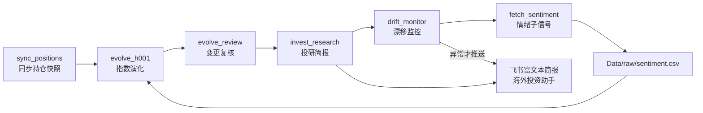
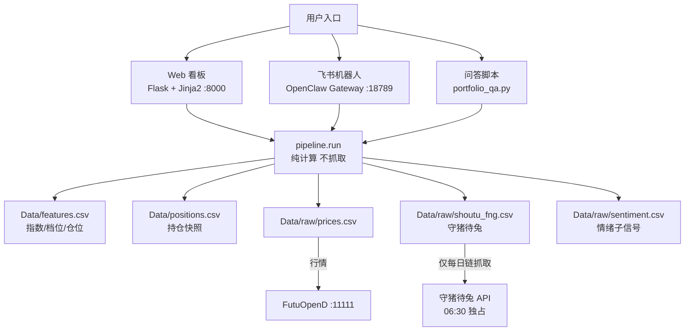

# 系统架构总览（贪恐系统）

> 目的：一张图看懂"数据从哪来、每天自动做什么、产出到哪去"。
> 关联：E1 每日链 / E2 漂移 / E4 因子 / E5 问答 / Web 看板。

## 1. 每日自动投研链（launchd `com.xingguo.fg-daily`，每日 05:30）

## 2. 系统分层（运行时）

## 3. 关键约束

| 约束 | 原因 |
|---|---|
| Web 看板**绝不抓取**守猪待兔 API | 每次刷新会覆盖当天样本 + 消耗月度额度 |
| 每日链 05:30 是唯一抓取方 | 避免样本污染、额度可控 |
| 公司电脑只跑静态数据 | 不调用富途/OKX 动态接口 |
| 所有服务 launchd 托管 + KeepAlive | 重启自恢复（Hermes dashboard 带 --no-open） |
